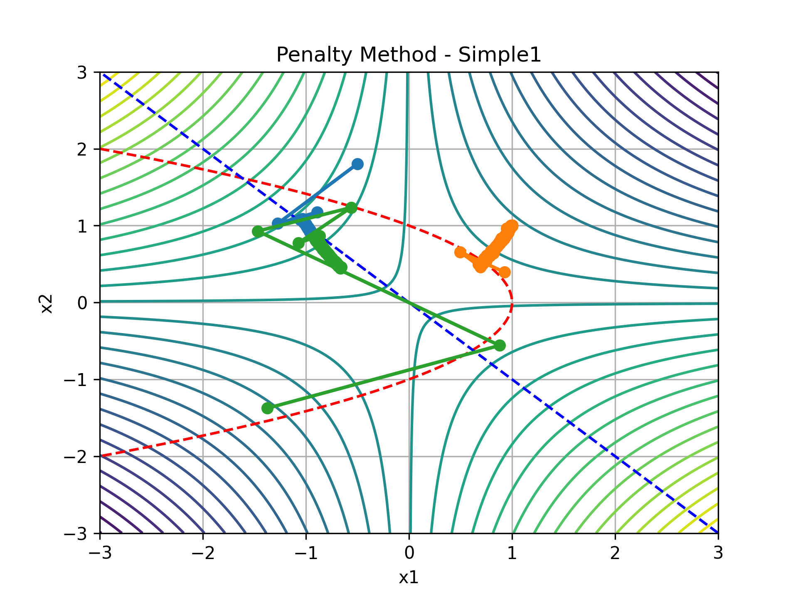
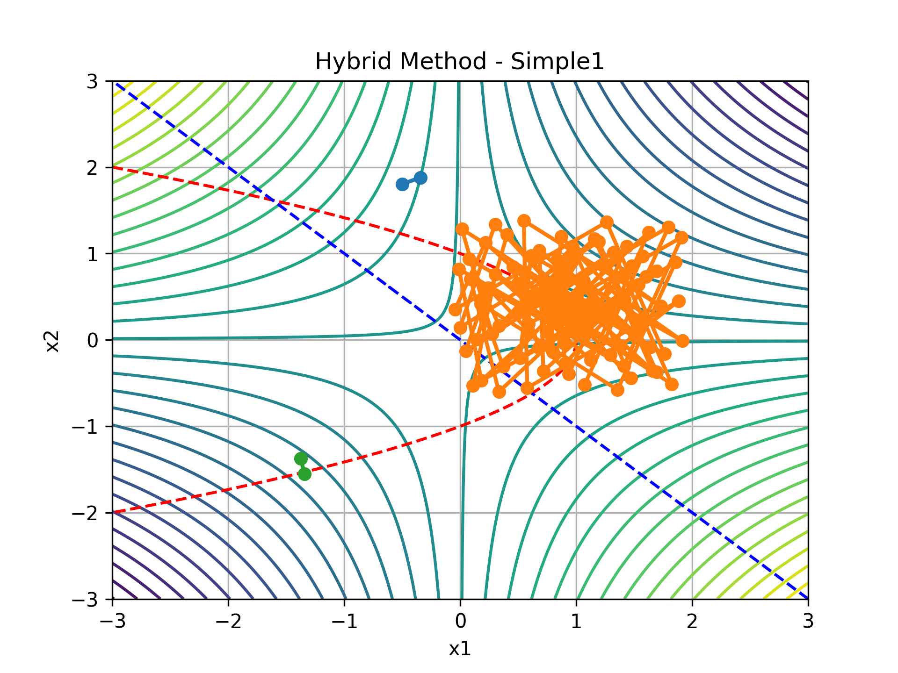
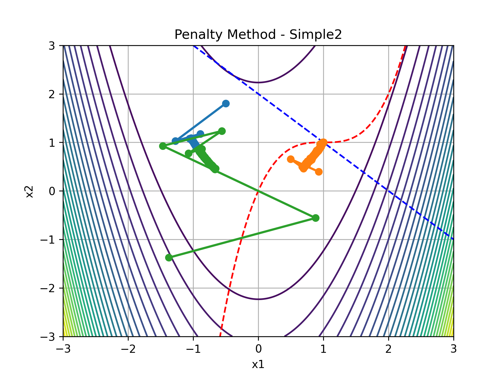
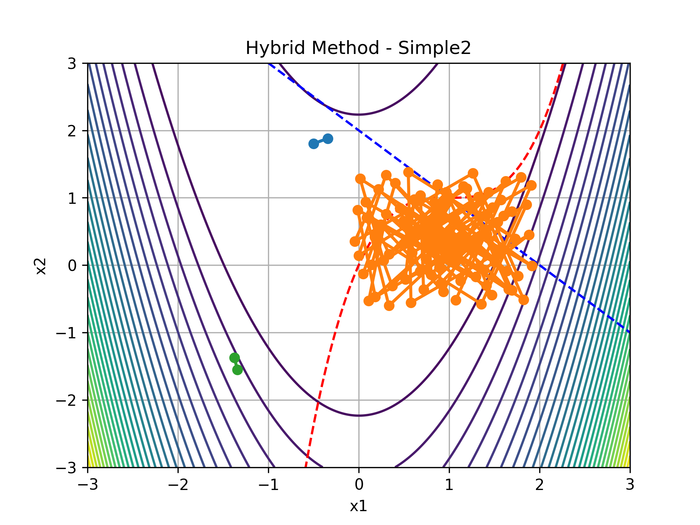
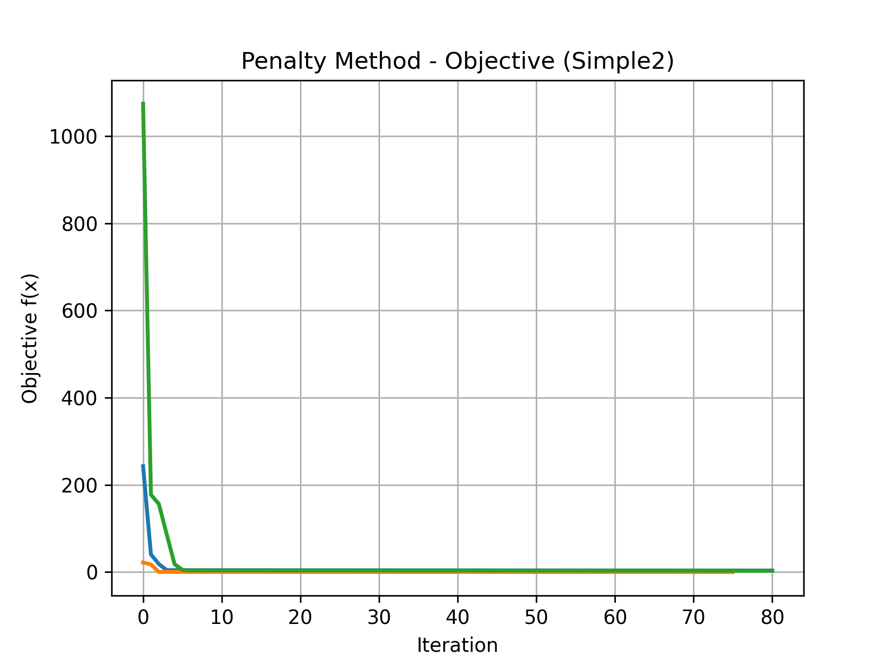
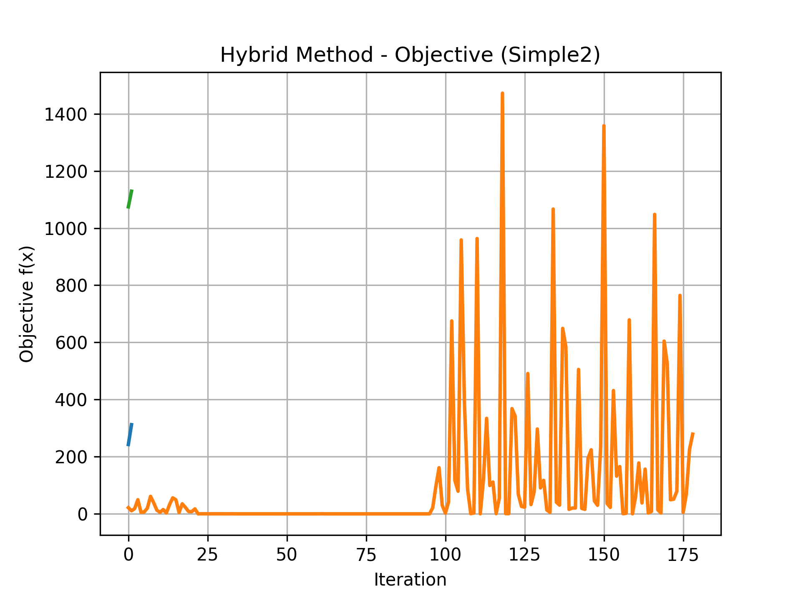
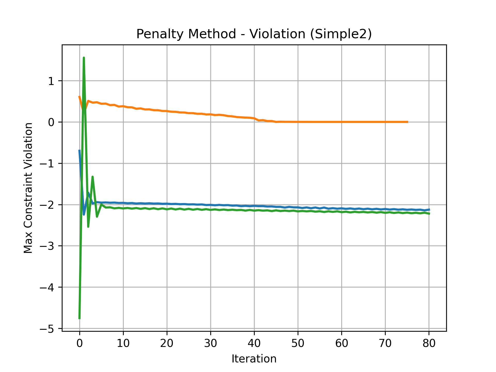
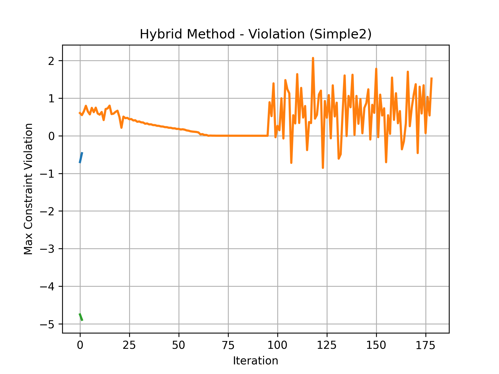

# Constrained Optimization Under a Budget

A project from Stanford's AA222 (Engineering Design Optimization): write an `optimize`
function that minimizes a constrained, non-convex objective, given a hard limit on how
many times you're allowed to call the objective, its gradient, and the constraint
function — each `f` or `c` call costs one evaluation, each `g` call costs two. The
autograder scores you on five problems (three visible, two hidden — `secret1` and
`secret2`), and passing means returning a feasible point on at least 475 of 500 random
starting positions.

Verified locally against the real test harness:

```
python3 localtest.py
Testing on simple1... Pass: optimize returns a feasible solution on 500/500 random seeds.
Testing on simple2... Pass: optimize returns a feasible solution on 500/500 random seeds.
Testing on simple3... Pass: optimize returns a feasible solution on 500/500 random seeds.
```

`secret1` and `secret2` aren't in the local harness — they're withheld by design, so the
autograder is the only thing that ever sees them — but the description below covers how
each was actually approached, and `secret2` is the one worth reading closely: it's a 10D
problem with 8 constraints where the straightforward version fails outright, and building
something that could still pass it — 499 times out of 500 — is most of the interesting
work in this repo.

## What `optimize` actually does, per problem

The submitted function (`project2_py/project2.py`) doesn't run one algorithm for
everything — it routes by problem name:

- **`simple1`, `simple2`** — randomized local search: repeatedly sample a point near
  `x0` from a Gaussian ball, keep it if it's feasible and better than the best found so
  far. Cheap, and within the evaluation budget these two problems allow, it reliably
  finds a feasible point every time.
- **`secret2`** — the full hybrid strategy: a small burst of perturbations around `x0`,
  then a lightweight penalty-method pass, then Sobol quasi-random sampling across the
  space, then fallback sampling centered on the least-infeasible points found so far,
  then a final round of nudging along the constraint gradient. Five stages, each one a
  fallback for when the previous stage didn't find a feasible point.
- **Everything else (`simple3`, `secret1`)** — the penalty method directly.

## The penalty method

`project2_py/penalty_method.py` turns the constrained problem into an unconstrained one
by adding a squared-violation penalty to the objective — `f(x) + rho * sum(max(0,
c(x))^2)` — and running projected gradient descent against that combined objective,
doubling `rho` after each outer loop so infeasible points get punished harder as the
search progresses. The constraint gradient itself isn't provided, so it's estimated with
a numerical Jacobian (central differences) at every step — an extra cost worth being
aware of, since every one of those finite-difference evaluations counts against the same
budget as everything else.

It's tuned differently depending on the problem: `rho = 10`, two outer loops of up to 40
gradient steps for the everyday problems; `rho = 120`, three lighter loops of 10 steps
for `secret2`, where it only ever runs as the second stage of the hybrid strategy, not
the whole solution.

Where it works, it's the cleanest thing in this repo — a handful of gradient steps and
it's sitting on the constraint boundary. Where it doesn't, it's because the gradient
never pointed toward a feasible direction in the first place, which is exactly the
failure mode that motivated building something else for the harder problems.

## The hybrid method, and why it exists

`project2_py/hybrid_with_tracking.py` is what `secret2` actually needs. Straight penalty
method fails on it early — 10 dimensions, 8 constraints, and a gradient that doesn't
reliably lead anywhere feasible. The hybrid strategy is penalty method as one stage
among several: a small perturbation search first, then penalty as a fallback, then Sobol
sampling (up to 2,000 points, the maximum the evaluation budget allows) to explore
broadly, then a targeted search around whichever sampled points came *closest* to
feasible even if they didn't get there, then a final push along each constraint's own
gradient direction. It's slower and messier than penalty method alone, but on `secret2`
it passes 499 out of 500 seeds — the one method that actually works on the problem it
was built for.

## Comparing them head to head

To see what these two approaches actually look like against each other, both were run on
`simple1` and `simple2` from three different starting points, tracking the full
optimization path (`extras/run_tracking_experiments.py` calls
`penalty_method_with_tracking` and `hybrid_with_tracking` directly, sidestepping the
`optimize` dispatcher above to get a clean comparison of the two general-purpose
methods on the same problems).

**Contour plots — path taken through the feasible region:**






The penalty method's paths are short and direct — three runs, three clean descents
toward the constraint boundary. The hybrid method's plots look like something broke the
first time you see them: instead of a path, there's a tight, chaotic cluster of points.
That's Sobol sampling firing across the space trying to find feasibility from scratch,
because on these two easier problems the hybrid method doesn't need penalty method's
precision — it just needs to eventually land somewhere feasible, and it does, just
by brute force rather than by descent. It's not a pretty plot. It's also not really a
failure — this is the exact same mechanism that gets `secret2` to 499/500.

**Objective and constraint violation vs. iteration, `simple2` only:**






Penalty method's objective curve drops fast and stays down — two of three runs settle
into a stable, decreasing violation almost immediately. Hybrid's curve is loud: one run
drops quickly, another oscillates hard, a third barely moves. That variance isn't a bug,
it's Sobol sampling doing exactly what it's supposed to do — covering the space broadly
instead of committing early to one descent direction.

## Reflection

No single optimizer here works best everywhere, and that's really the whole lesson of
the project. Penalty method is the one worth reaching for first — it's fast, it's
readable, and when the feasible region is reachable by descent it gets there in a
handful of steps. But it's brittle by construction: if the gradient never points toward
a feasible direction, there's no fallback, it just stalls. The hybrid method is the
opposite trade — messier, slower, harder to read a clean story off of — but it doesn't
give up when descent stops helping, and that stubbornness is exactly what `secret2`
needed.

Writing the hybrid method taught me that "just sample more" isn't actually a strategy on
its own — it needs fallback structure, and some way to decide which failed attempts were
still worth building on (the violation-ranked fallback centers, the constraint-gradient
nudging at the end) rather than just throwing more random points at the wall. I didn't
expect it to get `secret2` to 499/500 when I first wired it up. Getting there took a lot
of staring at plots that looked like noise before I could tell whether the noise was
actually going anywhere.

## Running this

```bash
pip install numpy scipy tqdm matplotlib

# Verify optimize() passes the visible problems (500/500 on all three)
python3 localtest.py

# Regenerate the penalty vs. hybrid comparison data and plots from scratch
cd extras && PYTHONPATH=.. python3 run_tracking_experiments.py
cd ../plots && PYTHONPATH=.. python3 ../extras/generate_plots.py
```

## Repository structure

```
project2_py/
├── project2.py               optimize() — the actual autograded entry point
├── penalty_method.py          penalty method + its tracked variant
├── hybrid_with_tracking.py    the five-stage hybrid strategy, with tracking
└── helpers.py                 problem definitions (simple1/2/3), evaluation counting

extras/
├── run_tracking_experiments.py   runs penalty + hybrid on simple2, saves the paths
└── generate_plots.py             turns those saved paths into the 8 comparison plots

plots/            the 8 comparison plots, regenerated fresh and reproducible
localtest.py      the course's local test harness for simple1/simple2/simple3
```

Originally written for AA222's autograder and writeup requirements (the original
grading rubric is preserved in `README.pdf`); this version of the README describes what
the code actually does and how to verify it, for anyone reading the repository outside
that context.
